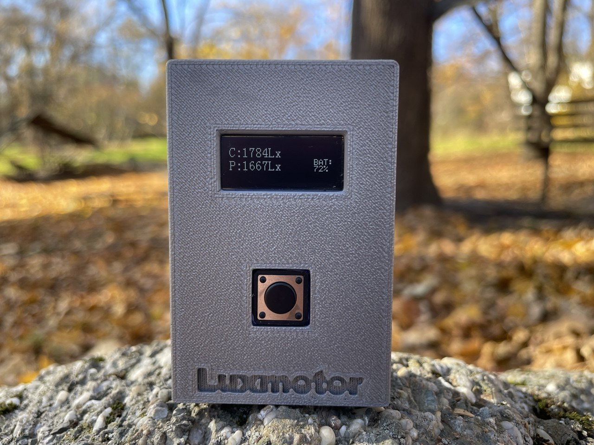
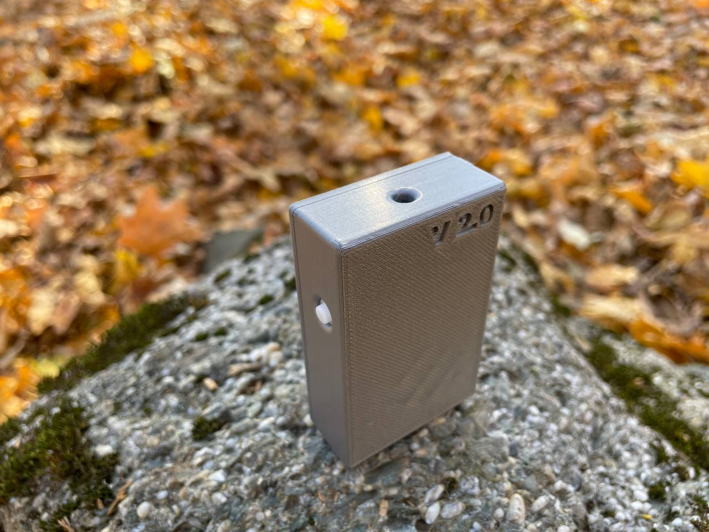
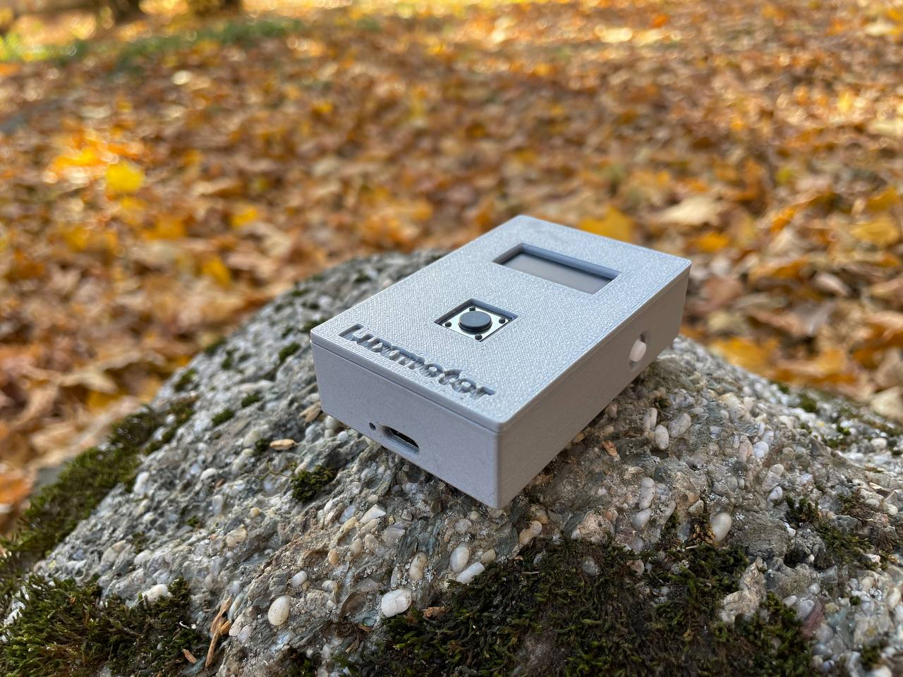
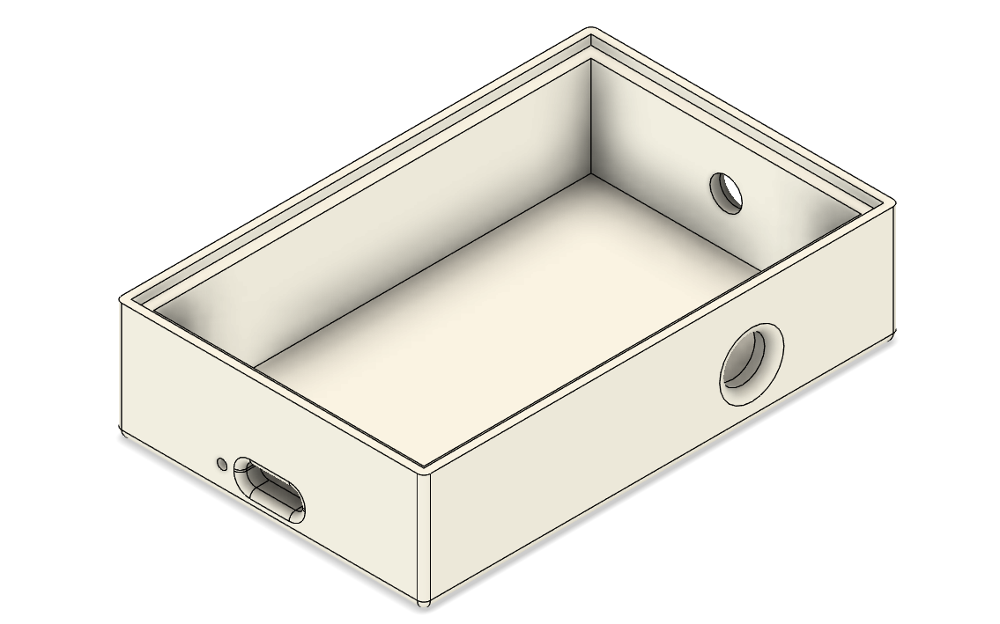
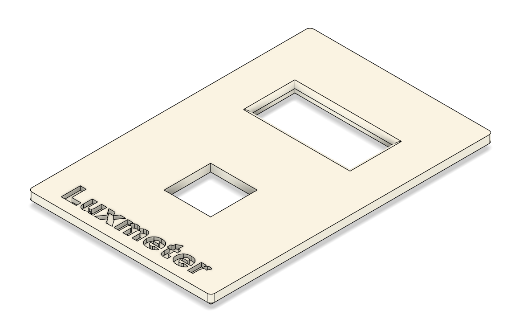

# Luxmeter

Цей проект — компактний люксметр на базі ATtiny85, оснащений OLED-дисплеєм 128×32, який вимірює інтенсивність освітлення (у люксах), відображує значення, а також здатний показувати стан заряду підключеної Li-ion батареї. Пристрій підтримує такі функції:

- Вимір освітленості за допомогою датчика BH1750
- Відображення поточних і збережених показників на OLED
- Вимір напруги батареї і конвертація у відсотки
- Мінімалістичний і енергоощадний дизайн на ATtiny85

Проект містить вихідний код, схему підключення, файли бітмапів для заставки, а також інструкції для збірки і калібрування. Це чудовий приклад простого, але функціонального приладу для домашньої електроніки та навчання.

# Схема пристрою

# 3D моделі
## [Моделі для друку корпусу](https://github.com/Stanislav-developer/luxmeter_attiny85_oled/tree/main/3D_Models)

# Вихідний код
- [Прошивка V1.0](https://github.com/Stanislav-developer/luxmeter_attiny85_oled/blob/main/Luxmeter_Firmware_V1.0/Luxmeter_Firmware_V1.0.ino)
- [Прошивка V2.0](https://github.com/Stanislav-developer/luxmeter_attiny85_oled/blob/main/Luxmeter_Firmware_V1.0/V2.0.ino)

# Огляд

## Список деталей
- ATtiny85  
- OLED 128x32  
- Step-up boost DC-DC converter  
- BH1750  
- Button  
- Li-ion battery  
- Switch  
