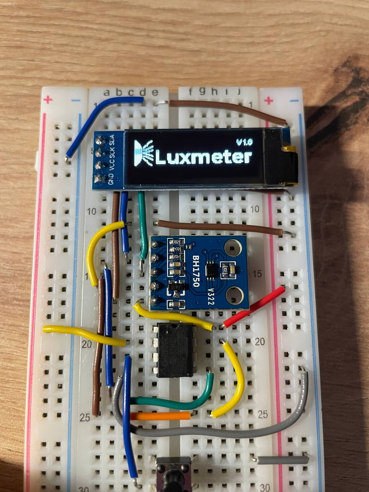
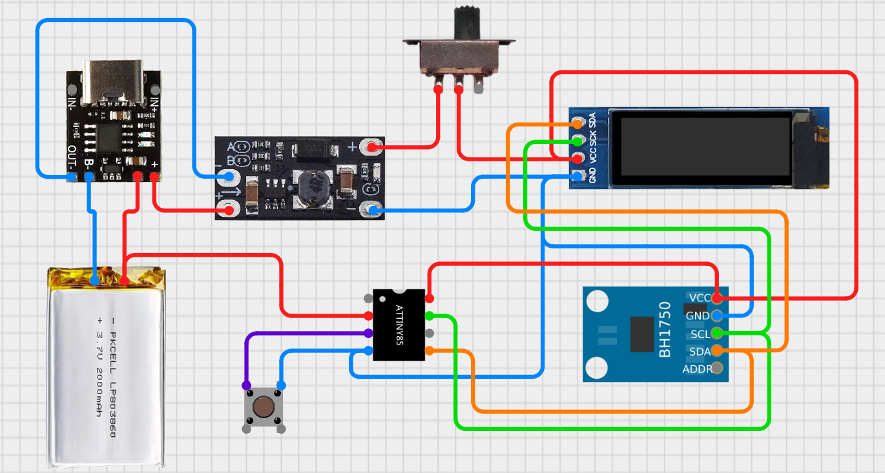

# Люксметр

Пристрій, що вимірює освітленість, запам’ятовує останнє значення по натиску кнопки та вміє вимірювати заряд акумулятора.

# Схема пристрою

## Список деталей
- ATtiny85  
- OLED 128x32  
- Step-up boost DC-DC converter  
- BH1750  
- Button  
- Li-ion battery  
- Switch  
